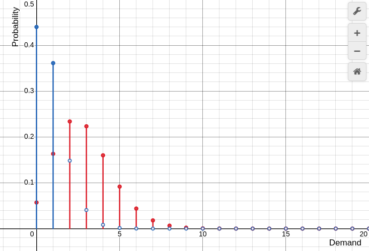
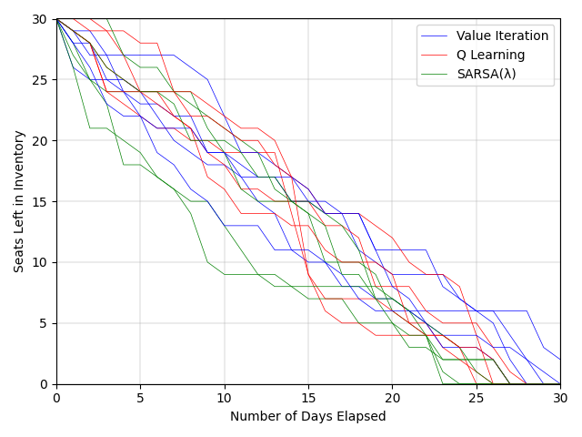
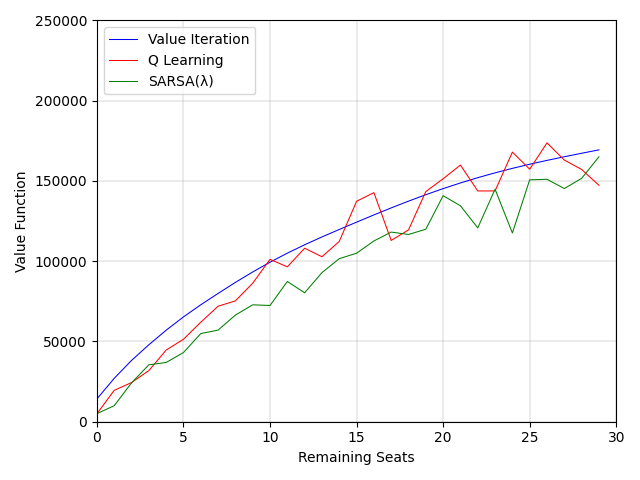
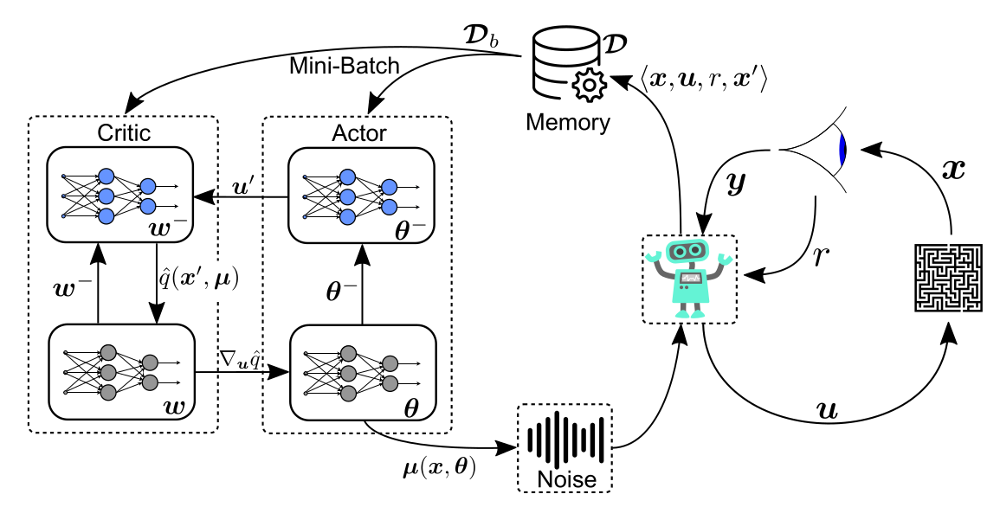
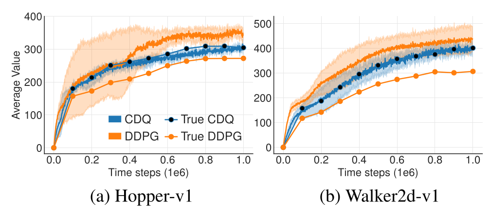
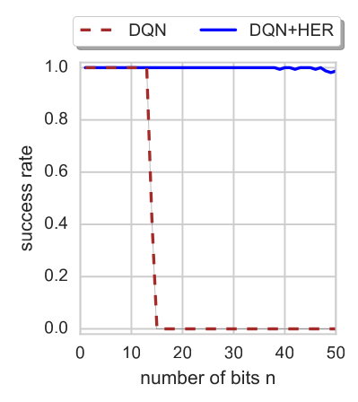
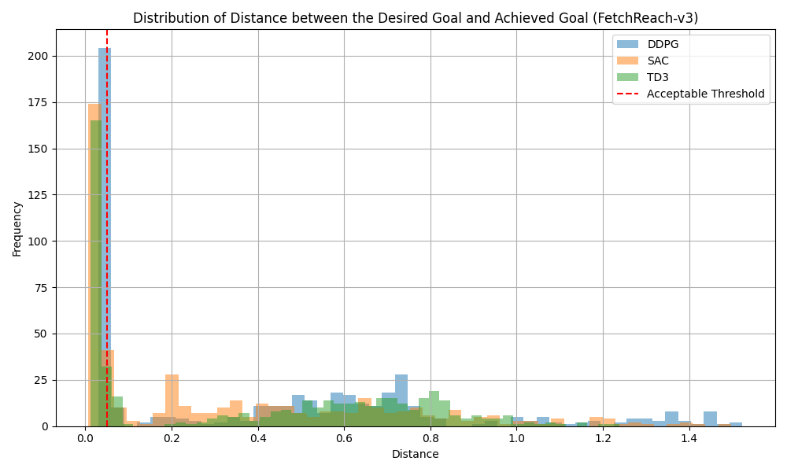
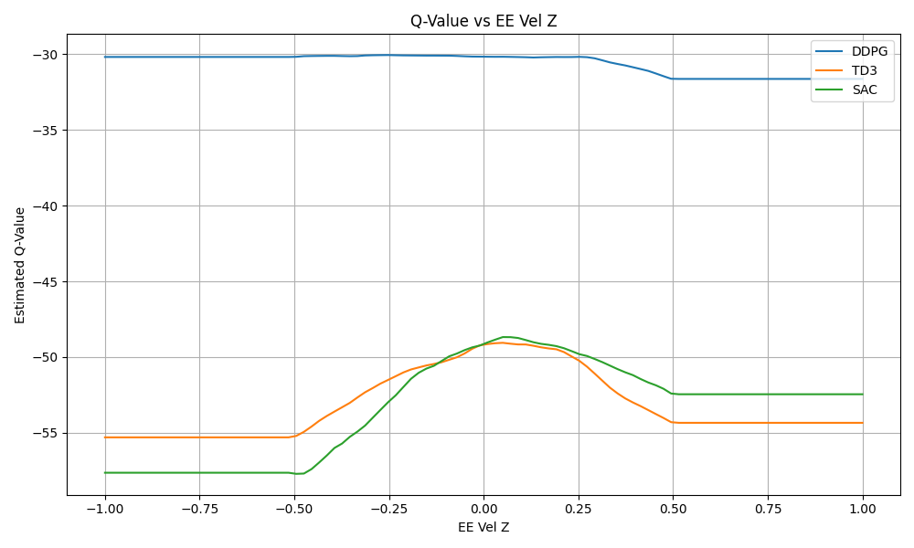

# Reinforcement Learning

## Finite Inventory Pricing

<table>
    <tr>
        <td align="center"></td>
        <td align="center"></td>
        <td align="center"></td>
    </tr>
    <tr>
        <td align="center"><a href="finite-inventory-pricing/slides/main.pdf">Demand Distribution</a></td>
        <td align="center"><a href="finite-inventory-pricing/slides/main.pdf">Simulated Trajectories</a></td>
        <td align="center"><a href="finite-inventory-pricing/slides/main.pdf">Learned Value Function</a></td>
    </tr>
</table>

## Deterministic Policy Gradient Methods

<table>
    <tr>
        <td align="center"></td>
        <td align="center"></td>
        <td align="center"></td>
    </tr>
    <tr>
        <td align="center">
<a href="deterministic-policy-gradient/main.pdf">Deep Deterministic Policy Gradient (DDPG)</a>
</td>
        <td align="center">
<a href="deterministic-policy-gradient/main.pdf">Twin Delayed DDPG (TD3)</a>
</td>
        <td align="center">
<a href="deterministic-policy-gradient/main.pdf">Hindsight Experience Replay (HER)</a>
</td>
    </tr>
</table>

## Fetch Reach and Push

<table>
    <tr>
        <td align="center"></td>
        <td align="center"></td>
        <td align="center"></td>
    </tr>
    <tr>
        <td align="center"><a href="fetch-mobile-manipulator/slides/main.pdf">FetchReach Demo</a></td>
        <td align="center"><a href="fetch-mobile-manipulator/slides/main.pdf">Histogram of Error</a></td>
        <td align="center"><a href="fetch-mobile-manipulator/slides/main.pdf">Learned Value Function</a></td>
    </tr>
</table>
